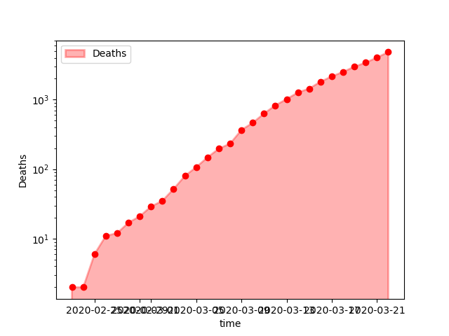

```{r echo=FALSE,message=FALSE}
JuliaCall::julia_markdown_setup(JULIA_HOME = "/opt/julia/bin", notebook = TRUE)
```


# The [Neherlab COVID-19](https://neherlab.org/covid19/) forecast model


```{julia}
include("COVID-19.jl");
```

This is the start of a country specific data structure. A dictionary is good enough for that purpose.

```{julia}
countryData = Dict();
```


We use Italy as an example.

```{julia}
country, hemisphere= "Italy", :north;
```

```{julia}
countryData[country] = Dict([(:name, country),
                             (:R₀, BaseR₀), 
                             (:hemisphere, hemisphere)]);

countryData[country][:peak] = peakDate[countryData[country][:hemisphere]];
countryData[country][:ϵ] = ϵ[countryData[country][:hemisphere]];
countryData[country][:mitigation] = DEFAULT_MITIGATION;

```


Let's get the Neherlab repo's data (the files can be updated with `updateData()`).

```{julia}
country_codes, cases, ICU_capacity, hospital_capacity, age_distribution = loadData();
```


```{julia}
# Clean up and extract country-specific information
country_codes = @where(country_codes, occursin.(country, :name));
countryShort = country_codes[:, Symbol("alpha-3")][1];

cases = @where(cases, occursin.(country, :location));
sort!(cases, :time);

ICU_capacity = @where(ICU_capacity, occursin.(country, :country))[!, :CriticalCare][1];
ICU_capacity = convert(Float64, ICU_capacity);

hospital_capacity = last(@where(hospital_capacity, occursin.(countryShort, :COUNTRY)), 1)[!, :VALUE][1];
hospital_capacity = convert(Float64, hospital_capacity);

age_distribution = @where(age_distribution, occursin.(country, :_key))[!, 2:10];

countryData[country][:country_code] = countryShort;
countryData[country][:cases] = cases;
countryData[country][:ICU_capacity] = ICU_capacity;
countryData[country][:hospital_capacity] = hospital_capacity;
countryData[country][:age_distribution] = age_distribution;
```


# Initialise parameters

## Fixed constants


```{julia}
StartDate = Date(2020, 3, 1);
StartDays = date2days(StartDate);

EndDate = Date(2020, 9, 1);
EndDays = date2days(EndDate);

tSpan = (StartDays, EndDays);
```

## Country-specific constants

Those are constants which cannot be changed to improve the model.

```{julia}
BED_max = countryData[country][:ICU_capacity];
ICU_max = countryData[country][:hospital_capacity] = hospital_capacity;

Age_Pyramid = transpose( Matrix(countryData[country][:age_distribution]));
Age_Pyramid_frac = Age_Pyramid / sum(Age_Pyramid);

ConfirmedAtStart = @where(countryData[country][:cases], :time .== StartDate)[!, :cases][1];
ConfirmedAtStart = ConfirmedAtStart .* Age_Pyramid_frac;

DeathsAtStart = @where(countryData[country][:cases], :time .== StartDate)[!, :deaths][1];
DeathsAtStart = DeathsAtStart .* Age_Pyramid_frac;
```

## Parameter vector


Those are parameters which can be changed to improve the model.

```{julia}
ConfirmedAtStartMultiplier = 3.0;
EstimatedAtStart = (ConfirmedAtStartMultiplier * ConfirmedAtStart) .* Age_Pyramid_frac;

parameters = [countryData[country][:R₀], 
              tₗ, tᵢ, tₕ, tᵤ, 
              γₑ, γᵢ, γⱼ, γₖ, 
              δₖ, δₗ, δᵤ, 
              StartDays, 
              ConfirmedAtStartMultiplier];
```

## Compartment vector


```{julia}
# Note that values are initialised at 1 to avoid division by zero

S0 = Age_Pyramid;
E0 = ones(nAgeGroup);
I0 = EstimatedAtStart;
J0 = ones(nAgeGroup);
H0 = ones(nAgeGroup);
C0 = ones(nAgeGroup);
R0 = ones(nAgeGroup);
D0 = DeathsAtStart;
K0 = ones(nAgeGroup);
L0 = ones(nAgeGroup);

# Everybody confirmed is in hospital. Assume 1 ICU bed to stay away from zeros.
BED = [ConfirmedAtStart];
ICU = [1.0];

P0 = vcat(S0, E0, I0, J0, H0, C0, R0, D0, K0, L0, BED, ICU);
dP = 0 * P0;
```

# Differential equation solver


```{julia}
include("COVID-19.jl")
```


```{julia}
model = ODEProblem(epiDynamics!, P0, tSpan, parameters);

# Note: progress steps might be too quick to see!
sol = solve(model, Tsit5(); progress = false, progress_steps = 5)
```


```{julia}
# The solutions are returned as an Array of Arrays: 
#  - it is a vector of size the number of timesteps
#  - each element of the vector is a vector of all the variables
nSteps = length(sol.t);
nVars  = length(sol.u[1]);

# Empty dataframe to contain all the numbers
# (When running a loop at top-level, the global keywrod is necessary to modify global variables.)
solDF = zeros((nSteps, nVars));
for i = 1:nSteps
    global solDF
    solDF[i, :] = sol.u[i]
end;

solDF = hcat(DataFrame(t = sol.t), DataFrame(solDF));

# Let's clean the names
compartments =  ["S", "E", "I", "J", "H", "C", "R", "D", "K", "L"];
solnames = vcat([:t], [Symbol(c * repr(n)) for c in compartments for n in 0:(nAgeGroup-1)], [:Beds], [:ICU]);
rename!(solDF, solnames);

```


```{julia}
# Create sums for each compartment
# (Consider solDF[!, r"S"])
# 
for c in compartments
    col =  [Symbol(c * repr(n)) for n in 0:(nAgeGroup-1)]
    s = DataFrame(C = sum.(eachrow(solDF[:, col])))
    rename!(s, [Symbol(c)])
        
    global solDF = hcat(solDF, s)
end;

# The D column gives the final number of dead.
println(last(solDF[:, Symbol.(compartments)], 5))
```


```{julia}
using PyPlot;

pyplot();
clf();
ioff();
plot_x = cases.time;
plot_y = cases.deaths;

fig, ax = PyPlot.subplots();

ax.plot(plot_x, plot_y, "ro");
ax.fill_between(plot_x, plot_y, color="red", linewidth=2, label="Deaths", alpha=0.3);
ax.legend(loc="upper left");
ax.set_xlabel("time");
ax.set_ylabel("Deaths");
ax.set_yscale("log");

PyPlot.savefig("images/Deaths.png");
```




This file contains ICU beds figures.


# Convert to simple matrix
age_distribution = Matrix(age_distribution);
show(age_distribution);
```


The last row shows the final sizes of the various compartments.

Next is the evolution of the over time.


```{julia}
pyplot();
clf();
ioff();

fig, ax = PyPlot.subplots();

ax.plot(solDF.t, solDF.D, label = "Recoveries");
ax.plot(solDF.t, solDF.R, label = "Forecast");
ax.plot(cases.t, cases.deaths, "ro", label = "Actual", alpha = 0.3);

ax.legend(loc="lower right");
ax.set_xlabel("time");
ax.set_ylabel("Individuals");
ax.set_yscale("log");

PyPlot.savefig("images/DeathsForecast.png");

```


It is clear the model forecasts a faster growth than reality. A parameter estimation is necessary.


```{julia}
pyplot();
clf();
ioff();

fig, ax = PyPlot.subplots();

ax.plot(solDF.t, solDF.Beds, label = "Beds");
ax.plot(solDF.t, solDF.ICU, label = "ICU");

ax.legend(loc="lower right");
ax.set_xlabel("time");
ax.set_ylabel("Number of beds");
ax.set_yscale("linear");

PyPlot.savefig("images/BedUsage.png");

```


It is clear that the requirements for beds quickly hits the available capacity


# Bilibliography

The Novel Coronavirus Pneumonia Emergency Response Epidemiology Team. The Epidemiological Characteristics of an Outbreak of 2019 Novel Coronavirus Diseases (COVID-19) — China, 2020[J]. China CDC Weekly, 2020, 2(8): 113-122. [LINK](http://weekly.chinacdc.cn/en/article/id/e53946e2-c6c4-41e9-9a9b-fea8db1a8f51)


